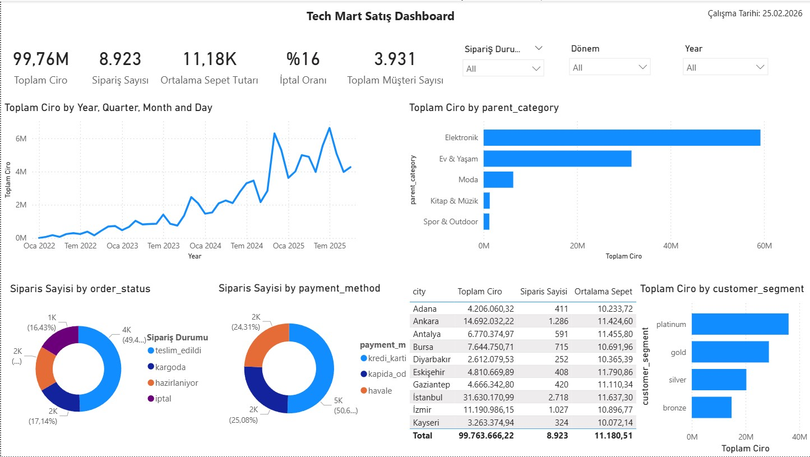

# Power BI ile Dashboard Geliştirme



Yukarıdaki dashboard, bu materyalde adım adım inşa edilen örnek çıktıdır. Sağ üstte üç **dropdown slicer** (Sipariş Durumu, Dönem, Year) tüm görselleri eş zamanlı filtreler. Üst satırdaki beş **KPI kartı** anlık iş performansını özetler: **99,76M ₺** toplam ciro, **8.923** sipariş sayısı, **11,18K ₺** ortalama sepet tutarı, **%16** iptal oranı ve **3.931** toplam müşteri. Sol alt köşedeki **çizgi grafik** 2022'den 2025'e kadar uzanan satış trendini çeyrek/ay detayıyla gösterir; grafikte belirgin büyüme ve sezonsal dalgalanmalar görülmektedir. Sağ taraftaki **yatay çubuk grafik** kategori bazlı ciroyu kıyaslar: Elektronik açık ara birinci, ardından Ev & Yaşam, Moda, Kitap & Müzik ve Spor & Outdoor gelmektedir. Alt bölümde iki **halka grafik** sipariş durumu (~%50 teslim edildi) ve ödeme yöntemi (~%51 havale) dağılımını, **tablo** ise 10 şehrin ciro ve sipariş karşılaştırmasını sunar. En sağdaki **çubuk grafik** müşteri segmentlerini (platinum, gold, silver, bronze) gelire göre sıralar. Tüm bu görsel tipleri, boyut (dimension) ve ölçü (measure) kavramlarının pratikte nasıl bir araya geldiğini gösterir.

---

## Bölüm 1: Dashboard Nedir?


Yukarıdaki kavram haritası, dashboard konusunun ana eksenlerini özetler. Merkezdeki "Dashboard" kavramı dört yönde açılır: **Dashboard Araçları** (Microsoft Power BI, Google Looker, Tableau, Grafana gibi yaygın platformlar), **İyi Dashboard'un Özellikleri** (performanslı çalışması, kullanıcıyı yormaması, filtrelenebilir olması), **Bilinmesi Gereken Noktalar** (domain bilgisi + veritabanı yapısı, SQL, DAX ile modelleme, görselleştirme ilkeleri) ve **Kim İçin Yapıldığı** (üst yönetim, pazarlama, model monitoring, operasyonel ekipler). Bu materyalin tüm bölümleri bu dört ekseni sırayla ele alır.

### 1.1 Tanım

Dashboard, birden fazla veri kaynağından gelen bilgilerin tek bir ekranda görselleştirilerek sunulduğu interaktif raporlama aracıdır. Amacı, karar vericiye durumu hızlıca özetlemek ve aksiyon almasını kolaylaştırmaktır.

**Dashboard ≠ Rapor**

| Özellik      | Dashboard              | Rapor                       |
| ------------ | ---------------------- | --------------------------- |
| Amaç         | Anlık durum özeti      | Detaylı analiz              |
| Sayfa sayısı | Genellikle 1 sayfa     | Çok sayfalı olabilir        |
| Güncelleme   | Otomatik / periyodik   | Tek seferlik veya periyodik |
| Etkileşim    | Filtreleme, drill-down | Genellikle statik           |

### 1.2 Kim İçin Yapılır?

Her dashboard'un bir **hedef kitlesi** vardır. Tasarıma başlamadan önce "bunu kim kullanacak?" sorusunun yanıtlanması gerekir.

| Hedef Kitle                         | Ne Görmek İster?                              | Örnek                                 |
| ----------------------------------- | --------------------------------------------- | ------------------------------------- |
| **C-Level (CEO, CFO)**              | Büyük resim, trend, KPI'lar                   | Aylık ciro, büyüme oranı, karlılık    |
| **Orta Kademe Yönetici**            | Departman performansı, hedef takibi           | Kategori bazlı satış, kampanya ROI    |
| **Operasyonel Ekip**                | Günlük metrikler, aksiyon gerektiren durumlar | Kargodaki sipariş sayısı, stok durumu |
| **Dış Paydaş (Yatırımcı, Müşteri)** | Özet performans, güven veren metrikler        | Büyüme trendi, müşteri memnuniyeti    |

### 1.3 Dashboard Türleri

| Tür             | Amaç                       | Güncelleme Sıklığı      | Örnek                              |
| --------------- | -------------------------- | ----------------------- | ---------------------------------- |
| **Stratejik**   | Uzun vadeli hedef takibi   | Haftalık / Aylık        | Yıllık gelir hedefi vs gerçekleşen |
| **Operasyonel** | Günlük iş süreçleri izleme | Gerçek zamanlı / Günlük | Kargodaki sipariş sayısı           |
| **Analitik**    | Derinlemesine veri analizi | İhtiyaca göre           | Müşteri segmentasyonu analizi      |
| **Taktik**      | Kısa vadeli hedef takibi   | Günlük / Haftalık       | Haftalık kampanya performansı      |

### 1.4 İyi Bir Dashboard'un Özellikleri

- **Tek sayfa:** Scroll gerektirmemeli; tüm bilgi tek bakışta görülebilmeli
- **Aksiyon odaklı:** Sadece "güzel görünen" değil, karar aldıran metrikler içermeli
- **Hedef kitleye uygun:** CEO'ya satır bazlı tablo değil, özet KPI gösterilmeli
- **Tutarlı:** Renk paleti, font ve görsel tipleri tutarlı olmalı
- **Filtrelenebilir:** Kullanıcı zaman aralığı veya kategori seçerek kendi analizini yapabilmeli

---

## Bölüm 2: Temel Kavramlar

### 2.1 Boyut vs Ölçü

Dashboard'daki her görsel iki temel bileşenden oluşur:

| Kavram                | Açıklama                             | Örnekler                                           |
| --------------------- | ------------------------------------ | -------------------------------------------------- |
| **Boyut (Dimension)** | Verileri gruplayan kategorik alanlar | Şehir, kategori, ödeme yöntemi, yıl, ay            |
| **Ölçü (Measure)**    | Hesaplanan sayısal değerler          | Toplam ciro, sipariş sayısı, ortalama sepet tutarı |

Örnek: "Şehir bazında toplam ciro" → **şehir** boyut, **toplam ciro** ölçüdür.

### 2.2 Kolon vs Measure

Power BI'da en sık karıştırılan kavramlardan biridir.

**Kolon:** Veritabanından gelen veya Power Query'de türetilen, tabloda her satırda bir değeri olan alandır. Veri yüklendiğinde bellekte saklanır.

**Measure (Ölçü):** DAX formülüyle tanımlanan, görsele sürüklendiğinde o anki bağlama (context) göre hesaplanan değerdir. Tabloda bir satırı yoktur, sadece formülü vardır.

|                          | Kolon                                        | Measure                                               |
| ------------------------ | -------------------------------------------- | ----------------------------------------------------- |
| **Nerede yaşar?**        | Tablonun içinde, her satırda bir değer       | Tabloya bağlı ama satırı yok, sadece formül           |
| **Ne zaman hesaplanır?** | Veri yüklenirken                             | Görsel render edilirken (her filtrede yeniden)        |
| **Filtrelenir mi?**      | Slicer'a atılabilir, satır bazlı filtrelenir | Filtrelenmez, bağlama göre kendisi yeniden hesaplanır |
| **Örnek**                | `city`, `order_status`, `line_total`         | `Toplam Ciro = SUM(data[line_total])`                 |

`line_total` bir **kolon**dur — her sipariş kaleminin tutarı satır satır tabloda durur.  
`Toplam Ciro = SUM(data[line_total])` bir **measure**'dır — "şehir" boyutuna göre kırdığınızda her şehir için ayrı hesaplar, filtre değiştikçe sonuç değişir.

> **Pratik kural:** Dashboard'da gösterilen her sayısal değeri measure olarak tanımlayın. Kolonları doğrudan Values alanına sürüklemeyin.

### 2.3 KPI (Key Performance Indicator)

KPI, iş hedeflerini ölçmek için kullanılan temel metriklerdir. Bir metriğin KPI olup olmadığını test etmek için şu soruyu sormak yeterli: **"Bu rakam düşerse veya yükselirse ne aksiyon alırız?"** Cevap yoksa, o metrik KPI değildir.

E-ticaret için tipik KPI'lar:

| KPI                   | Formül                         | Ne İfade Eder?            |
| --------------------- | ------------------------------ | ------------------------- |
| Toplam Ciro           | SUM(line_total)                | Genel satış performansı   |
| Sipariş Sayısı        | COUNT(order_id)                | Talep hacmi               |
| Ortalama Sepet Tutarı | Ciro / Sipariş Sayısı          | Müşteri harcama davranışı |
| İptal Oranı           | İptal Sipariş / Toplam Sipariş | Operasyonel sağlık        |

### 2.4 Tablo Yapıları ve İlişkiler

Power BI'da veri modeli kurarken tabloların birbirleriyle nasıl ilişkilendiğini anlamak kritiktir. Örnek e-ticaret veritabanı 7 tablodan oluşmaktadır:

```
CUSTOMERS ──1:N──> ORDERS ──1:N──> ORDER_ITEMS ──N:1──> PRODUCTS ──N:1──> CATEGORIES
                     │
                     └──N:1──> CAMPAIGNS
```

- **Fact Table (Olgu Tablosu):** `orders` ve `order_items` — ölçülebilir olayları (satışlar) içerir
- **Dimension Table (Boyut Tablosu):** `customers`, `products`, `categories`, `campaigns` — olayları tanımlayan bilgileri içerir

Bu yapıya **Star Schema** denir ve Power BI'ın en verimli çalıştığı modeldir.

### 2.5 SQL ile Veri Hazırlama

Power BI'a veri aktarmadan önce verinin doğru şekilde hazırlanması gerekir. İhtiyaç duyulan alanları SQL ile çekip temiz bir veri seti oluşturmak, gereksiz tüm tabloyu almaktan çok daha verimlidir.

> `data/ecommerce.db` dosyasını DB Browser for SQLite ile açıp "Execute SQL" sekmesinde aşağıdaki sorgular çalıştırılabilir.

**SELECT ve LIMIT — tabloyu keşfetme:**

```sql
SELECT * FROM orders LIMIT 10;

SELECT order_id, order_date, order_status, total_amount
FROM orders
LIMIT 10;
```

**WHERE — filtreleme:**

```sql
SELECT * FROM orders
WHERE order_status = 'iptal';

SELECT * FROM orders
WHERE order_date >= '2024-01-01' AND order_date < '2025-01-01';
```

**GROUP BY + aggregation — gruplama ve toplama:**

```sql
SELECT order_status, COUNT(*) AS siparis_sayisi
FROM orders
GROUP BY order_status;

SELECT c.city, SUM(o.total_amount) AS toplam_ciro
FROM orders o
JOIN customers c ON o.customer_id = c.customer_id
GROUP BY c.city
ORDER BY toplam_ciro DESC;
```

**INNER JOIN — eşleşen kayıtları birleştirme:**

INNER JOIN, iki tabloda da eşleşen kayıtları getirir. Eşleşmeyen satırlar sonuçta yer almaz.

```sql
SELECT o.order_id, o.order_date, c.city, c.customer_segment
FROM orders o
INNER JOIN customers c ON o.customer_id = c.customer_id
LIMIT 10;
```

**LEFT JOIN — sol tablonun tamamını getirme:**

LEFT JOIN, sol tablodaki tüm satırları getirir. Sağ tabloda eşleşme yoksa o kolonlar NULL döner.

```sql
SELECT o.order_id, o.total_amount, cam.campaign_name
FROM orders o
LEFT JOIN campaigns cam ON o.campaign_id = cam.campaign_id
LIMIT 10;
-- campaign_name NULL olanlar = kampanyasız siparişler
```

### 2.6 DAX Temelleri

DAX (Data Analysis Expressions), Power BI'da hesaplama yapmak için kullanılan formül dilidir. Giriş seviyesi için en sık kullanılan fonksiyonlar:

| Fonksiyon         | Ne Yapar?                                  | Örnek                                                          |
| ----------------- | ------------------------------------------ | -------------------------------------------------------------- |
| `SUM()`           | Bir kolondaki değerleri toplar             | `SUM(data[line_total])`                                        |
| `COUNTROWS()`     | Tablodaki satır sayısını sayar             | `COUNTROWS(orders)`                                            |
| `DIVIDE()`        | Güvenli bölme (sıfıra bölme hatası vermez) | `DIVIDE([Ciro], [Siparis])`                                    |
| `CALCULATE()`     | Filtre uygulayarak hesaplama yapar         | `CALCULATE(COUNTROWS(orders), orders[order_status] = "iptal")` |
| `DISTINCTCOUNT()` | Benzersiz değer sayısını sayar             | `DISTINCTCOUNT(orders[customer_id])`                           |

### 2.7 Power BI Arayüzü

Power BI Desktop 3 ana görünümden oluşur:

1. **Report View:** Görsellerin oluşturulduğu ve düzenlendiği ana ekran
2. **Data View:** Tablolardaki veriyi Excel gibi görmek için
3. **Model View:** Tablolar arası ilişkilerin görüldüğü ve düzenlendiği ekran

Sağ taraftaki **Visualizations** panelinden görsel tipi seçilir; **Fields** panelinden alanlar sürükle-bırak ile görsellere eklenir.

---

## Bölüm 3: İş Problemi Simülasyonu

### 3.1 Senaryo

> **Şirket:** TechMart — Türkiye merkezli e-ticaret şirketi  
> **Kuruluş:** 2022  
> **Ürün yelpazesi:** Elektronik, moda, ev & yaşam, spor, kitap (5 ana kategori, 13 alt kategori)  
> **Müşteri tabanı:** ~5.000 kayıtlı müşteri  
> **Pazar:** 12 Türk şehri

### 3.2 CEO'dan Gelen Talep

> *"Şirketimizin satış performansını tek bir ekranda görebileceğim bir dashboard istiyorum. Her ay başında buna bakarak genel durumu anlamak ve gerekli aksiyonları almak istiyorum. Aşağıdaki soruların cevabını bu dashboard'da görebilmeliyim:*
>
> 1. *Aylık satış trendimiz nasıl? Büyüyor muyuz?*
> 2. *Siparişlerin ne kadarı teslim ediliyor, ne kadarı iptal oluyor?*
> 3. *Hangi kategoriler en çok satıyor?*
> 4. *Hangi şehirlerden en çok sipariş geliyor?*
> 5. *Müşteri segmentlerimiz gelire ne kadar katkı sağlıyor?*
> 6. *Müşteriler en çok hangi ödeme yöntemini tercih ediyor?"*

### 3.3 İsterleri Analiz Etme

Her ister bir **boyut + ölçü** çiftine dönüştürülür:

| #   | İster                     | Boyut (Dimension) | Ölçü (Measure)                         | Görsel Tipi |
| --- | ------------------------- | ----------------- | -------------------------------------- | ----------- |
| 1   | Aylık satış trendi        | Yıl-Ay            | Toplam Ciro                            | Line Chart  |
| 2   | Sipariş durumu dağılımı   | order_status      | Sipariş Sayısı                         | Donut Chart |
| 3   | Kategori bazlı satış      | category_name     | Toplam Ciro                            | Bar Chart   |
| 4   | Şehir bazlı satış (Top 5) | city              | Toplam Ciro                            | Table       |
| 5   | Segment bazlı gelir       | customer_segment  | Toplam Ciro                            | Bar Chart   |
| 6   | Ödeme yöntemi dağılımı    | payment_method    | Sipariş Sayısı                         | Donut Chart |
| -   | Genel KPI'lar             | -                 | Ciro, Sipariş, Ort. Sepet, İptal Oranı | Card        |

### 3.4 Veriyi SQL ile Hazırlama

Veritabanından Power BI'a **tek bir flat tablo** aktarılır. Tüm kırılımları (şehir, kategori, segment, ödeme yöntemi vb.) Power BI tarafında yapmak mümkündür; bu sayede tek veri kaynağıyla model ilişkisi kurmaya gerek kalmaz ve slicer'lar doğrudan çalışır.

**Veri aktarım yöntemleri:**

| Yöntem              | Nasıl?                                            | Avantajı                            |
| ------------------- | ------------------------------------------------- | ----------------------------------- |
| **ODBC Bağlantısı** | Power BI > Get Data > ODBC > SQLite driver        | Canlı bağlantı, otomatik güncelleme |
| **CSV Export**      | SQL ile çekip CSV'ye kaydet, Power BI'a import et | Basit, driver kurulumu gerektirmez  |

Giriş seviyesi çalışmalar için CSV export yöntemi önerilir.

---

#### Ana Sorgu: Dashboard'u Besleyecek Tek Tablo

Her satır bir **sipariş kalemi** (order_item) seviyesindedir. Yalnızca dashboard isterlerini karşılayan kolonlar çekilir:

```sql
SELECT
    o.order_id,
    strftime('%Y', o.order_date)    AS order_year,
    strftime('%m', o.order_date)    AS order_month,
    strftime('%Y-%m', o.order_date) AS year_month,
    o.order_status,
    o.payment_method,
    oi.quantity * oi.unit_price * (1 - oi.discount_rate / 100.0) AS line_total,
    c.customer_id,
    c.city,
    c.customer_segment,
    parent_cat.category_name AS parent_category
FROM order_items oi
INNER JOIN orders      o          ON oi.order_id   = o.order_id
INNER JOIN customers   c          ON o.customer_id  = c.customer_id
INNER JOIN products    p          ON oi.product_id  = p.product_id
INNER JOIN categories  cat        ON p.category_id  = cat.category_id
LEFT  JOIN categories  parent_cat ON cat.parent_category_id = parent_cat.category_id;
```

**JOIN'lerin açıklaması:**

| JOIN | Ne Yapıyor? | Neden Bu Tür? |
|------|------------|---------------|
| `order_items INNER JOIN orders` | Her kalemi siparişiyle eşleştir | Her kalemin mutlaka bir siparişi var |
| `orders INNER JOIN customers` | Her siparişi müşteriyle eşleştir | Her siparişin mutlaka bir müşterisi var |
| `order_items INNER JOIN products` | Her kalemi ürünle eşleştir | Her kalemin mutlaka bir ürünü var |
| `products INNER JOIN categories cat` | Her ürünü alt kategorisiyle eşleştir | Her ürünün mutlaka bir kategorisi var |
| `categories cat LEFT JOIN categories parent_cat` | Alt kategorinin ana kategorisini bul | Ana kategorilerin üstü NULL — LEFT JOIN ile bu satırlar da dahil edilir |

**Son LEFT JOIN neden farklı?**

`categories` tablosu hiyerarşik yapıdadır; aynı tablo hem alt hem ana kategoriyi tutar:

| category_id | category_name       | parent_category_id |
|-------------|---------------------|--------------------|
| 1           | Elektronik          | NULL               |
| 6           | Telefon & Aksesuar  | 1                  |
| 7           | Bilgisayar & Tablet | 1                  |

Tablo iki farklı takma adla iki kez kullanılır: `cat` alt kategoriyi, `parent_cat` üst kategoriyi temsil eder. "Elektronik" gibi ana kategorilerin `parent_category_id`'si NULL olduğundan INNER JOIN kullansak bu satırlar düşer; LEFT JOIN ile `parent_category` kolonu NULL gelir ama satır kaybolmaz.

**Her kolona neden ihtiyaç var:**

| Kolon | Hangi İster İçin? |
|-------|-------------------|
| `order_id` | Sipariş sayısı KPI (DISTINCTCOUNT) |
| `order_year`, `order_month` | Slicer filtreleri |
| `year_month` | Aylık satış trendi (Line Chart X-axis) |
| `order_status` | Sipariş durumu dağılımı (Donut Chart) |
| `payment_method` | Ödeme yöntemi dağılımı (Donut Chart) |
| `line_total` | Tüm ciro hesapları ve kategori kırılımı |
| `customer_id` | Benzersiz müşteri KPI (DISTINCTCOUNT) |
| `city` | Şehir bazlı satış (Table) |
| `customer_segment` | Segment bazlı gelir (Bar Chart) |
| `parent_category` | Kategori bazlı satış (Bar Chart) |

> **Granülarite notu:** Her satır bir sipariş kalemidir. Bir siparişte 3 ürün varsa 3 satır olur. `line_total` her satırda benzersiz olduğundan `SUM(line_total)` doğrudan toplam ciroyu verir. Sipariş ve müşteri sayısı gibi metriklerde ise aynı `order_id` birden fazla satırda tekrarladığından `DISTINCTCOUNT` kullanılır.

---

#### CSV'ye Export Etme (Python ile)

```python
import sqlite3
import pandas as pd

conn = sqlite3.connect('data/ecommerce.db')

query = """
SELECT
    o.order_id,
    strftime('%Y', o.order_date)    AS order_year,
    strftime('%m', o.order_date)    AS order_month,
    strftime('%Y-%m', o.order_date) AS year_month,
    o.order_status,
    o.payment_method,
    oi.quantity * oi.unit_price * (1 - oi.discount_rate / 100.0) AS line_total,
    c.customer_id,
    c.city,
    c.customer_segment,
    parent_cat.category_name AS parent_category
FROM order_items oi
INNER JOIN orders      o          ON oi.order_id   = o.order_id
INNER JOIN customers   c          ON o.customer_id  = c.customer_id
INNER JOIN products    p          ON oi.product_id  = p.product_id
INNER JOIN categories  cat        ON p.category_id  = cat.category_id
LEFT  JOIN categories  parent_cat ON cat.parent_category_id = parent_cat.category_id
"""

df = pd.read_sql(query, conn)
df.to_csv('data/data.csv', index=False, encoding='utf-8-sig')
conn.close()
print(f"data.csv: {len(df)} rows exported")
```

> `encoding='utf-8-sig'` kullanılmasının nedeni: Power BI'ın Türkçe karakterleri (ş, ç, ğ, ü, ö, ı) doğru okuması için BOM işaretli UTF-8 gereklidir.

---

## Bölüm 4: Power BI'da Dashboard Yapımı

### 4.1 Veriyi Power BI'a Alma

1. Power BI Desktop'ı açın
2. **Home > Get Data > Text/CSV** seçin
3. `data.csv` dosyasını seçin
4. Açılan önizleme penceresinde verilerin doğru göründüğünü kontrol edin > **Load**

Tek CSV, tek tablo — model ilişkisi kurmaya gerek yok.

**Veri tipi kontrolü (Power Query Editor — Home > Transform Data):**

| Kolon | Olması Gereken Tip |
|-------|-------------------|
| `line_total` | Decimal Number |
| `order_year` | Text |
| `order_month` | Text |

Tipler doğruysa **Close & Apply** ile kapatın.

### 4.2 DAX Measure'ları Oluşturma

Report View'da **Fields** panelinde `data` tablosuna sağ tıklayıp **New Measure** ile aşağıdaki measure'lar oluşturulur.

`line_total` her satırda benzersiz olduğundan `SUM` ile toplanır. `order_id` ve `customer_id` birden fazla satırda tekrarlandığından sayarken `DISTINCTCOUNT` kullanılır:

```
Toplam Ciro = SUM(data[line_total])
```

```
Siparis Sayisi = DISTINCTCOUNT(data[order_id])
```

```
Ortalama Sepet = DIVIDE([Toplam Ciro], [Siparis Sayisi], 0)
```

```
Iptal Orani =
DIVIDE(
    CALCULATE(
        DISTINCTCOUNT(data[order_id]),
        data[order_status] = "iptal"
    ),
    [Siparis Sayisi],
    0
)
```

```
Benzersiz Musteri = DISTINCTCOUNT(data[customer_id])
```

### 4.3 Dashboard Layout

```
┌──────────────────────────────────────────────────────────────────┐
│  [Slicer: Yıl]   [Slicer: Ay]                     TechMart     │
│                                                  Satış Dashboard │
├────────────┬────────────┬────────────┬────────────┬─────────────┤
│   TOPLAM   │  SİPARİŞ   │  ORT.SEPET │   İPTAL    │  BENZERSİZ  │
│    CİRO    │   SAYISI   │   TUTARI   │   ORANI    │   MÜŞTERİ   │
│  Card (1)  │  Card (2)  │  Card (3)  │  Card (4)  │   Card (5)  │
├────────────────────────────────────┬─────────────────────────────┤
│                                    │                             │
│   AYLIK SATIŞ TRENDİ              │  KATEGORİ BAZLI CİRO        │
│   Line Chart (6)                   │  Clustered Bar Chart (7)   │
│                                    │                             │
│   X: year_month                    │  Y: category_name          │
│   Y: [Toplam Ciro]                │  X: [Toplam Ciro]          │
│                                    │                             │
├──────────────────┬─────────────────┼──────────────┬──────────────┤
│                  │                 │              │              │
│  SİPARİŞ DURUMU  │  ÖDEME YÖNTEMİ │ ŞEHİR BAZLI  │  SEGMENT     │
│  Donut Chart (8) │  Donut Chart(9)│ SATIŞ Top5   │  BAZLI CİRO  │
│                  │                 │ Table (10)   │  Bar Chart   │
│ Legend: status   │ Legend: payment │              │  (11)        │
│ Values: Siparis  │ Values: Siparis│ city | ciro  │              │
│         Sayisi   │        Sayisi  │              │ segment|ciro │
└──────────────────┴─────────────────┴──────────────┴──────────────┘
```
